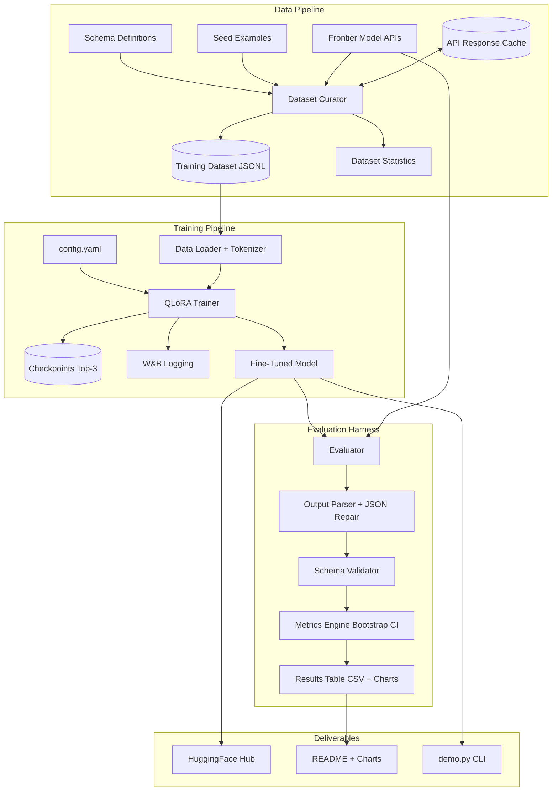

# Design Document: Small Model Supremacy

## Overview

Small Model Supremacy is an end-to-end ML pipeline that fine-tunes a Qwen2.5 small model (1.5B–3B parameters) using QLoRA to outperform frontier models (GPT-4o, Claude 3.5 Sonnet) on structured data extraction from unstructured text.

The system comprises four major subsystems:
1. **Dataset Curation Pipeline** — generates, validates, and manages synthetic training data using frontier model APIs
2. **Training Pipeline** — QLoRA fine-tuning with memory-efficient 4-bit quantization on consumer GPUs
3. **Evaluation Harness** — rigorous benchmarking with statistical significance testing
4. **Output Parsing & Validation** — robust JSON extraction with repair heuristics

### Key Design Decisions

| Decision | Choice | Rationale |
|----------|--------|-----------|
| Base model | Qwen2.5-1.5B / Qwen2.5-3B | Strong instruction-following at small scale, active community |
| Fine-tuning method | QLoRA (4-bit NF4 + LoRA r=64) | Fits 3B model training in 24GB VRAM |
| Training framework | HuggingFace Transformers + PEFT + bitsandbytes | Industry standard, well-documented |
| Data generation | Claude/GPT-4 API with caching | High-quality synthetic pairs, reproducible |
| Experiment tracking | Weights & Biases | Rich visualization, team-friendly |
| Schema validation | jsonschema (Python) | Supports JSON Schema draft 2020-12 |
| Config management | YAML (via Pydantic validation) | Human-readable, type-safe at runtime |

## Architecture

### High-Level System Diagram



## Components and Interfaces

### 1. Schema Manager (src/schemas/)

```python
@dataclass
class SchemaDefinition:
    domain: str
    complexity: Literal["simple", "medium", "complex"]
    schema: dict
    description: str
    field_count: int

class SchemaManager:
    def __init__(self, schemas_dir: Path): ...
    def load_all(self) -> dict[str, SchemaDefinition]: ...
    def validate_schema(self, schema: dict) -> ValidationResult: ...
    def validate_instance(self, instance: dict, schema_id: str) -> ValidationResult: ...
    def get_by_complexity(self, complexity: str) -> list[SchemaDefinition]: ...
```

### 2. Dataset Curator (src/data/)

```python
@dataclass
class DataExample:
    input_text: str
    expected_output: dict
    schema_id: str
    difficulty_level: Literal["simple", "medium", "complex"]
    source_metadata: SourceMetadata

class DatasetCurator:
    def __init__(self, config: DataConfig, schema_manager: SchemaManager): ...
    def generate_examples(self, schema_id: str, count: int) -> list[DataExample]: ...
    def validate_example(self, example: DataExample) -> ValidationResult: ...
    def split_dataset(self, examples: list[DataExample], seed: int = 42) -> DatasetSplits: ...
    def compute_statistics(self, dataset: DatasetSplits) -> DatasetStats: ...
    def save_jsonl(self, examples: list[DataExample], path: Path) -> None: ...

class APIClient:
    def __init__(self, provider: str, cache_dir: Path): ...
    def generate(self, prompt: str, params: GenerationParams) -> str: ...
```

### 3. Training Pipeline (src/training/)

```python
@dataclass
class TrainConfig:
    model_name: str
    lora_rank: int = 64
    lora_alpha: int = 128
    learning_rate: float = 2e-4
    batch_size: int = 4
    gradient_accumulation_steps: int = 4
    num_epochs: int = 3
    max_memory_gb: float = 24.0

class Trainer:
    def __init__(self, config: TrainConfig): ...
    def setup_model(self) -> None: ...
    def setup_qlora(self) -> None: ...
    def train(self, train_dataset, val_dataset) -> TrainResult: ...
    def resume_from_checkpoint(self, checkpoint_path: Path) -> None: ...
```

### 4. Output Parser (src/parsing/)

```python
class OutputParser:
    def parse(self, raw_output: str) -> ParseResult: ...
    def _extract_json(self, text: str) -> Optional[str]: ...
    def _repair_json(self, text: str) -> Optional[str]: ...

@dataclass
class ParseResult:
    success: bool
    parsed_output: Optional[dict]
    repair_applied: bool
    repair_type: Optional[str]
    raw_output: str
```

### 5. Evaluation Harness (src/evaluation/)

```python
@dataclass
class EvalMetrics:
    schema_validity: float
    field_f1: float
    exact_match: float
    avg_latency_ms: float
    valid_json_rate: float
    confidence_intervals: dict

class Evaluator:
    def __init__(self, config: EvalConfig, schema_manager: SchemaManager): ...
    def evaluate_model(self, model, test_set) -> EvalMetrics: ...
    def evaluate_baseline(self, provider: str, test_set) -> EvalMetrics: ...
    def generate_results_table(self, results) -> pd.DataFrame: ...
    def generate_charts(self, results, output_dir: Path) -> None: ...
```

### 6. Configuration (src/config/)

```python
class ProjectConfig(BaseModel):
    model: ModelConfig
    training: TrainConfig
    data: DataConfig
    evaluation: EvalConfig
    infrastructure: InfraConfig

    @classmethod
    def from_yaml(cls, path: Path) -> "ProjectConfig": ...
    def validate_all(self) -> list[str]: ...
```

## Data Models

### Dataset Format (JSONL)

```json
{
    "input_text": "Dr. Jane Smith presented her research on CRISPR...",
    "expected_output": {"speaker_name": "Dr. Jane Smith", "topic": "CRISPR gene editing"},
    "schema_id": "conference_talk_simple",
    "difficulty_level": "simple",
    "source_metadata": {"generation_model": "claude-3-5-sonnet", "generation_timestamp": "2024-12-01T10:30:00Z", "prompt_id": "gen_001"}
}
```

### Configuration File (config.yaml)

```yaml
model:
  name: "Qwen/Qwen2.5-3B"
  max_seq_length: 2048
training:
  lora_rank: 64
  lora_alpha: 128
  learning_rate: 2.0e-4
  batch_size: 4
  gradient_accumulation_steps: 4
  num_epochs: 3
  warmup_steps: 100
  checkpoint_interval: 500
  eval_interval: 100
  early_stopping_patience: 3
  early_stopping_threshold: 0.001
  max_memory_gb: 24.0
data:
  schemas_dir: "schemas/"
  output_dir: "data/"
  seed: 42
  min_tokens: 50
  max_tokens: 2000
  adversarial_ratio: 0.15
evaluation:
  baselines: ["gpt-4o", "claude-3-5-sonnet", "base_model"]
  temperature: 0.0
  seed: 42
  bootstrap_iterations: 1000
infrastructure:
  wandb_project: "small-model-supremacy"
  device: "auto"
```

### Project Directory Structure

```
small-model-supremacy/
├── config.yaml
├── pyproject.toml
├── Dockerfile
├── README.md
├── CHANGELOG.md
├── demo.py
├── train.py
├── evaluate.py
├── generate_data.py
├── schemas/
├── data/
├── cache/
├── src/
│   ├── config/schema.py
│   ├── schemas/manager.py
│   ├── data/curator.py, api_client.py, tokenizer_utils.py
│   ├── training/trainer.py, callbacks.py, memory.py
│   ├── parsing/output_parser.py
│   ├── evaluation/evaluator.py, metrics.py, visualization.py
│   └── utils/logging.py
├── tests/
│   └── properties/
├── checkpoints/
└── results/
```

## Correctness Properties

### Property 1: Schema Document Validation
For any JSON document, the schema validator accepts it iff it is valid JSON Schema draft 2020-12.

### Property 2: Train/Test Set Non-Overlap
For any dataset split, no input_text (whitespace-normalized) appears in both train and test sets.

### Property 3: Invalid Example Filtering
For any generated example that fails schema validation, it is discarded with logged context.

### Property 4: Adversarial Ratio Invariant
For any training set, adversarial examples comprise at least 15% of total.

### Property 5: Data Serialization Round-Trip
For any valid DataExample, serialize/deserialize preserves all fields.

### Property 6: Token Length Filtering
After filtering, all examples have token count in [50, 2000].

### Property 7: Checkpoint Retention Top-3
Exactly the top 3 checkpoints by lowest val_loss are retained.

### Property 8: Early Stopping Trigger
Early stopping triggers iff 3 consecutive intervals show < 0.001 improvement.

### Property 9: Metric Mathematical Invariants
All metrics in [0,1], exact_match=true implies field_f1=1.0, CI lower <= mean <= upper.

### Property 10: Results Grouped by Difficulty
Results contain separate rows per difficulty level, union equals full set.

### Property 11: Configuration Validation
Invalid configs rejected with descriptive error identifying problematic field.

### Property 12: Seed Determinism
Same seed produces byte-identical results.

### Property 13: Dataset Statistics Consistency
min <= median <= max, coverage in [0%,100%], counts sum to total.

### Property 14: JSON Extraction and Repair Round-Trip
Valid JSON in arbitrary text is correctly extracted; corrupted JSON is repaired.

### Property 15: Schema Validation on Parsed Output
Validation accepts conforming outputs and rejects non-conforming ones.

### Property 16: Parse Rate Invariant
schema_validity <= valid_json_rate always.

### Property 17: Prompt Template Completeness
Formatted prompt contains schema, description, and example pair.

### Property 18: Whitespace-Only Rejection
Whitespace-only strings recorded as failure without repair attempt.

## Error Handling

- Never halt on a single bad example — log and continue
- Save checkpoints before risky operations
- Descriptive error messages with context
- Graceful degradation — prefer partial results over none
- API failures: exponential backoff, cache fallback, skip with warning
- Memory overflow: terminate and report peak usage
